# パワポ作成ルール

----
## スライドの目的
- 人を動かす
- より早く、正確に、少ない労力で仕事が進む

----
## 作成準備
- スライドによって得られる結果を紙に書き出す
- ストーリーを紙に書き出す
- チャートグラフのデッサンを書き出す

----
## スライドルール
- フォーマット
- ヘッドメッセージとチャート
- 全体構成
- 何を描かないか

----
## グラフのルール
- グラフの種類
- 数字でグラフを決める
- 比較でグラフを決める

----
## 図解のルール
- 基本フォーマット
- オリジナル
- 人間の認知

----
## プレゼンテーション
- スライド全体の流れ
- セクションの流れ

----
## 環境作り
- パワポの設定
- おすすめの設定

---
# スライドの目的
効率的に人を動かし、仕事を進める

----
## 人を動かす

    

    ビジネスの根幹は人を動かすことである 
    ターゲットを希望の行動に促すことを目指す   
    そのために、ターゲットの心理やインセンティブ、自分自身を分析していく
    

  

  <small>
    <a href="https://onl.bz/q5xHTij">PowerPoint資料作成プロフェッショナルの大原則</a>
  </small>

----
## より早く、正確に、少ない労力で仕事が進む

    

      一人歩き資料を作成=自分の説明が不要な資料 
      結果として、自分がいなくても話が進みスムーズに仕事が進む 
      以下の条件が揃っていると一人歩きする資料になる
    

    <ul style="list-style-type: disc; padding-left: 20px;">
      <li>メッセージが1枚１枚で明確</li>
      <li>チャートの伝えたいことが一目瞭然</li>
      <li>根拠がある</li>
      <li>アクションが明確</li>
    </ul>

---
# 作成準備
まずは、スライドではなく、紙に書き出していく

----
## スライドによって得られる結果を紙に書き出す

    

    家の設計図がないと家を建てないように、目的がないのに資料を作成しない 
    「誰」に「自分」が「何」を伝え「どのような行動」を取ってもらうかを書く
    

  

  <small>
    <a href="https://onl.bz/q5xHTij">PowerPoint資料作成プロフェッショナルの大原則</a>
  </small>

----
## ストーリーを紙に書き出す

    

      1つのスライドに1つ自分のスタンス(仮説や主張)を主張する 
      これらのメッセージを書いてから、全体のストーリを検討し、何が必要なデータかを洗い出す 
    

  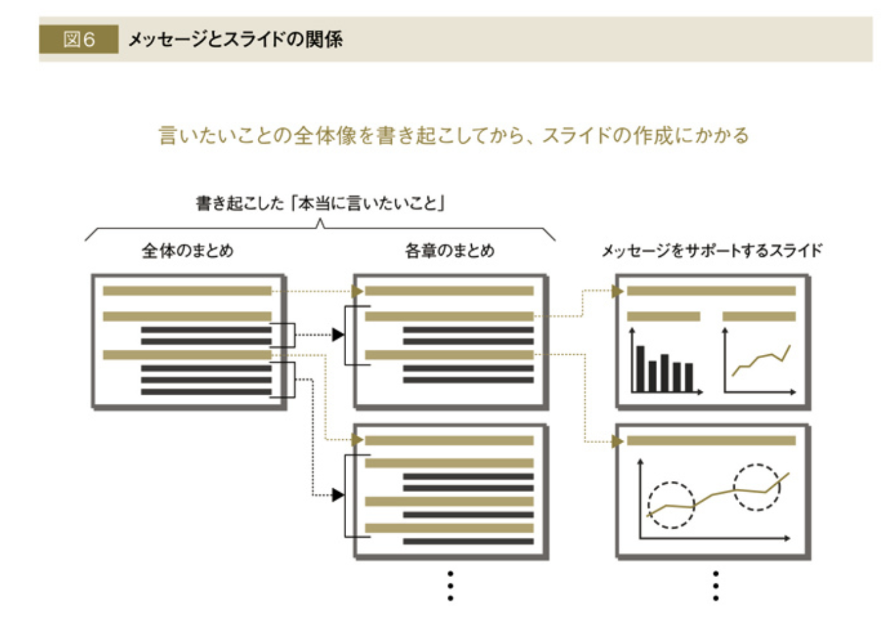

  <small>
    <a href="https://onl.bz/L9Zwew3">外資系コンサルのスライド作成術</a>
  </small>

----
## チャートのデッサンを書き出す

    

    実際の情報収集やデータ整理を始める前に、スライドのスタンスに対して 
    どのようなデータを集め、どのように図示すれば主張が補強されるかを考える
    

  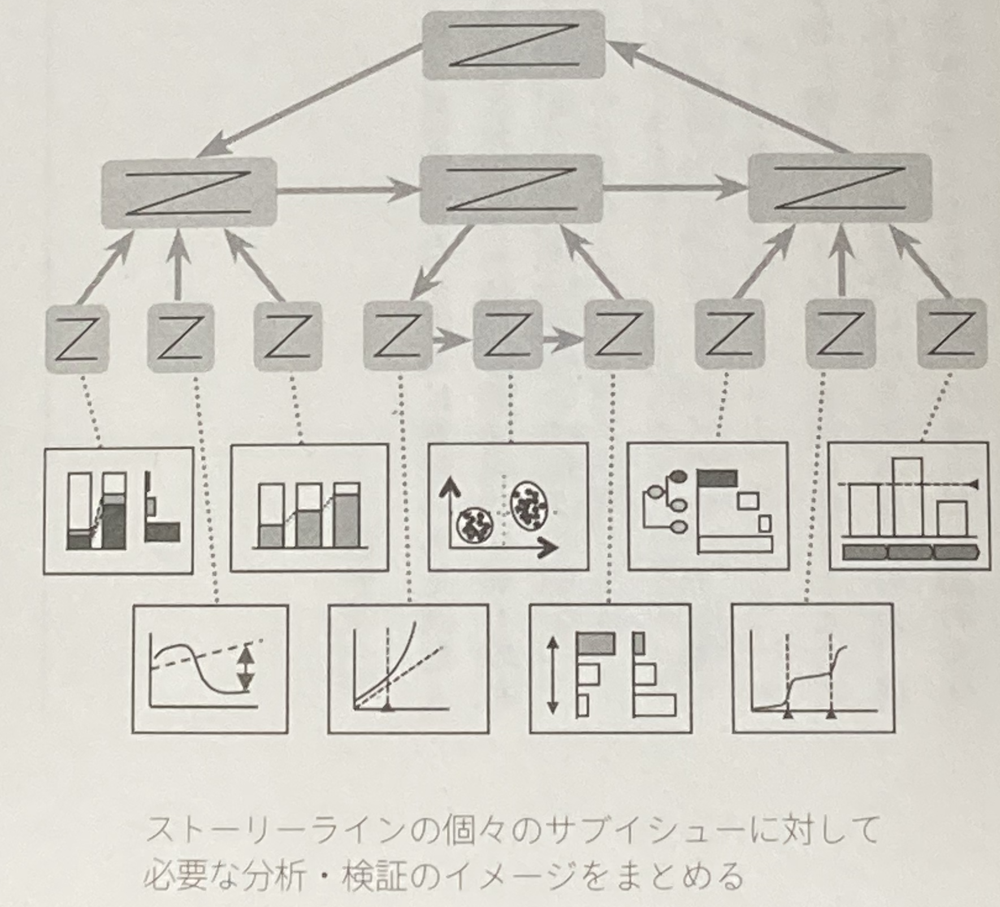

  <small>
    <a href="https://onl.bz/haXWKqB">ISSUE Driven</a>
  </small>

---
# スライドルール
常に一定のルールに従って、スライドを作成する

----
## フォーマット

    

      常に一定のフォーマットに従うことで、ストレスなく理解できる
    

  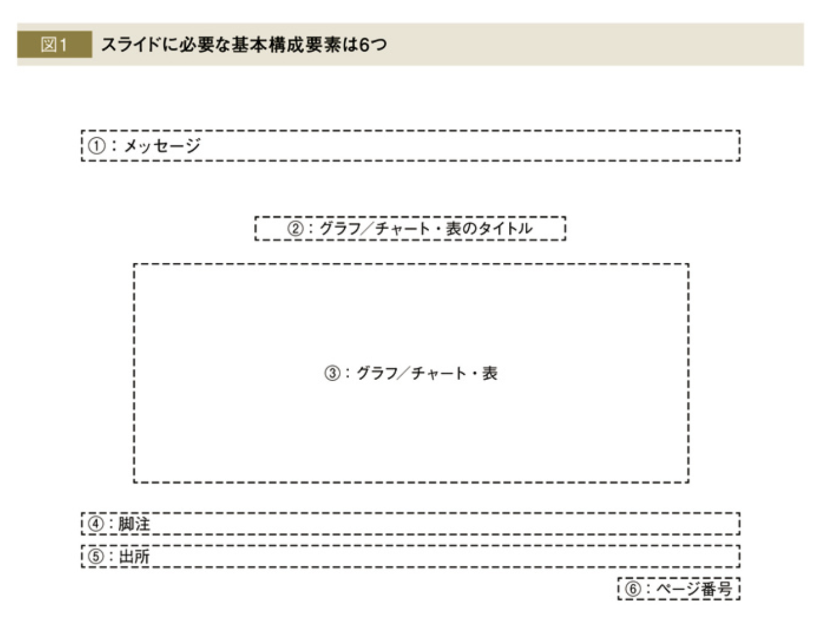

  <small>
    <a href="https://onl.bz/L9Zwew3">外資系コンサルのスライド作成術</a>
  </small>

----
## 全体構成

    

    スライドの全体構成はタイトル・サマリ・目次・結論が基本 
    サマリは過去から現在。資料作成理由（過去）と資料概要（現在） 
    結論は現在から過去。資料のまとめ（現在）とネクストアクション（未来）
    

  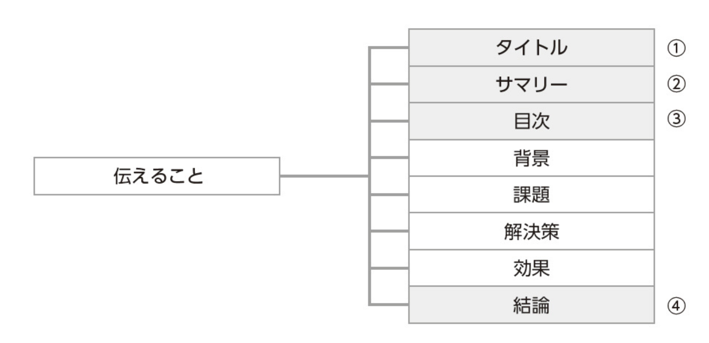

  <small>
    <a href="https://onl.bz/q5xHTij">PowerPoint資料作成プロフェッショナルの大原則</a>
  </small>

----
## ヘッドメッセージとチャート

    

      チャート=グラフ（定量の可視化）と図解（定性の可視化）と定義 
      良いチャートは、ヘッドメッセージに登場する言葉が軸になっている 
      良いチャートは、ヘッドメッセージのスタンスを一目瞭然で補強する
    

  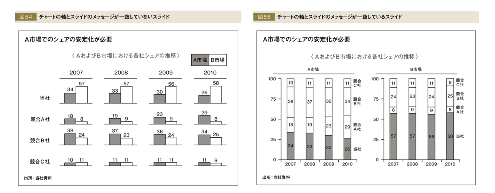

  <small>
    <a href="https://onl.bz/L9Zwew3">外資系コンサルのスライド作成術</a>
  </small>

----
## 何を描かないかを決める

    

    何を描かないことを決め、SN比率を高めることでわかりやすいスライドになる 
    チャートでSN比を高めるためには、重複を排除することを意識する
    

  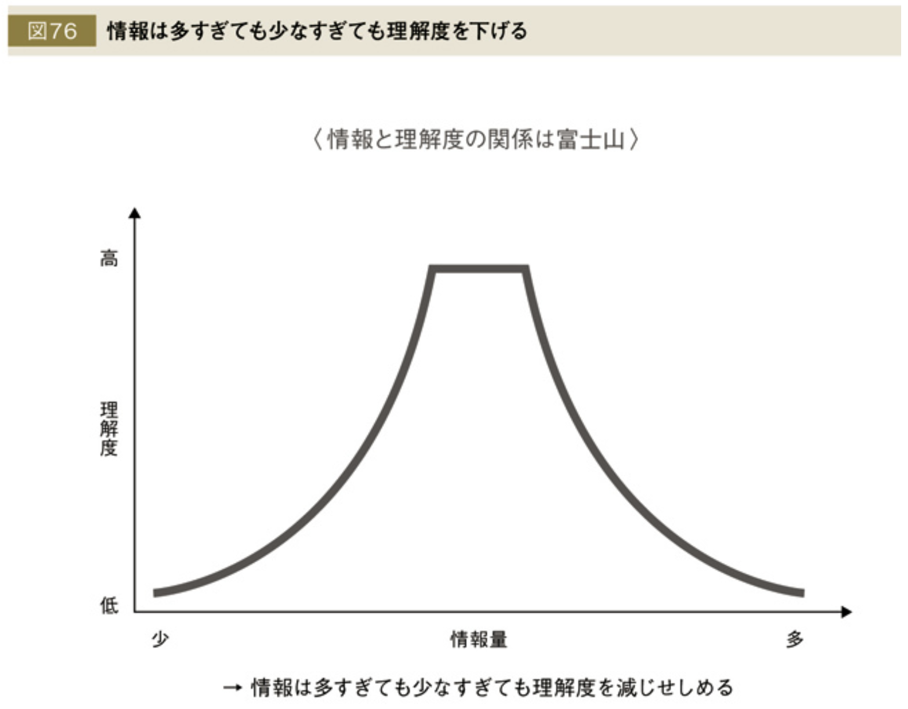
  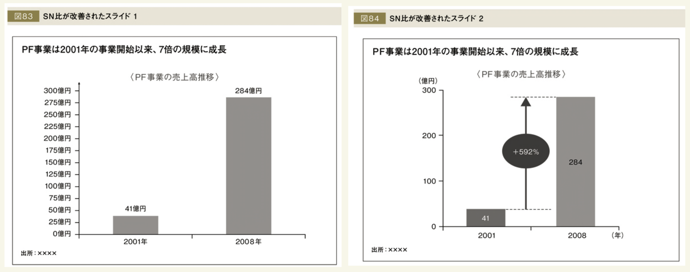

  <small>
    <a href="https://onl.bz/L9Zwew3">外資系コンサルのスライド作成術</a>
  </small>

---
# グラフのルール
メッセージとの関係が一目瞭然でないグラフは数値型かグラフのフォーマットが間違っている

----
## グラフの種類

    

    基本的なものは5種類で、応用として組み合わせがある
    

    <ul style="list-style-type: disc; padding-left: 20px;">
    <li>積み上げ・・構成を表すのが得意</li>
    <li>横棒・・・・変化を表すのが得意+長い項目名が見やすい</li>
    <li>縦棒・・・・変化を表すのが得意+時系列を意識しやすい</li>
    <li>折線・・・・複数データや比較を表すのが得意</li>
    <li>散布図・・・因果関係を表すのが得意</li>
    </ul>

  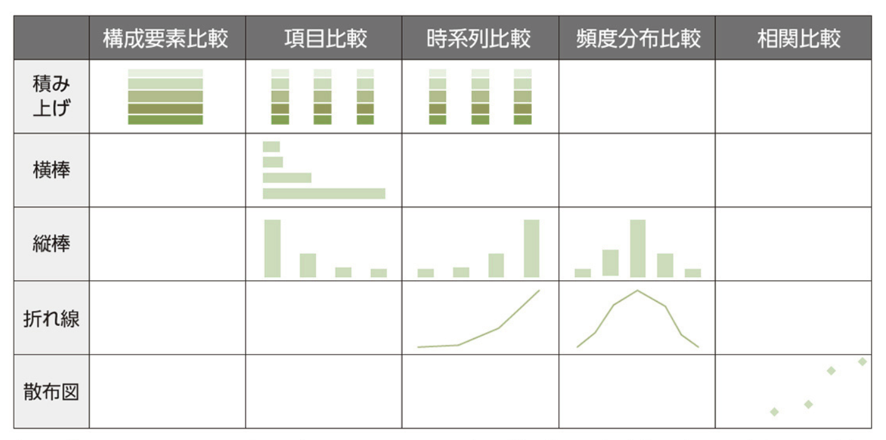

  <small>
    <a href="https://onl.bz/q5xHTij">PowerPoint資料作成プロフェッショナルの大原則</a>
  </small>

----
## 比較でグラフを決める

    

    グラフで比較する事柄を意識、相性の良いグラフを利用する
    

    <ul style="list-style-type: disc; padding-left: 20px;">
    <li>構成要素比較・・内訳</li>
    <li>項目比較・・・・独立したもの同士の比較</li>
    <li>時系列比較・・・時系列による変化の比較</li>
    <li>頻度分布比較・・出現頻度</li>
    <li>相関比較・・・・因果関係</li>
    </ul>

  

  <small>
    <a href="https://onl.bz/q5xHTij">PowerPoint資料作成プロフェッショナルの大原則</a>
  </small>

----
## 数字でグラフを決める

    

    グラフで利用する数字を意識し、相性の良いグラフを利用する
    

    <ul style="list-style-type: disc; padding-left: 20px;">
    <li>実数値・・・絶対的な量</li>
    <li>構成比・・・全体に占める割合</li>
    <li>指数値・・・時間的な比率変化</li>
    </ul>

  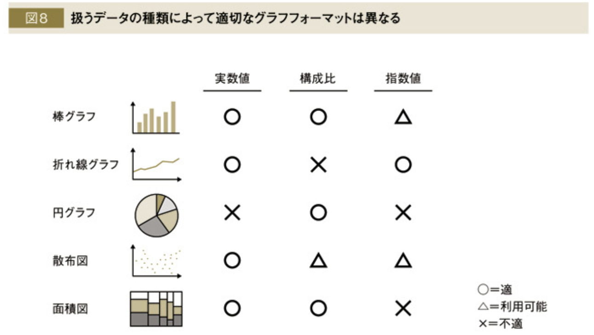

  <small>
    <a href="https://onl.bz/L9Zwew3">外資系コンサルのスライド作成術</a>
  </small>

---
# 図解のルール
メッセージから図解を決める。必ずメッセージと軸を揃える。 
人間の認知を意識したレイアウトにする。

----
## 基本フォーマット

    

    メッセージが以下の6パターンに当てはまる場合、基本フォーマットを適用する
    

    <ul style="list-style-type: disc; padding-left: 20px;">
    <li>列挙・・・因果関係なし</li>
    <li>背景・・・複数の原因が一つの結果（同時に）</li>
    <li>拡散・・・一つの原因が複数の結果</li>
    <li>合流・・・複数の原因が一つの結果（時間を経て）</li>
    <li>フロー・・順々に事象が発生する</li>
    <li>回転・・・循環している</li>
    </ul>

  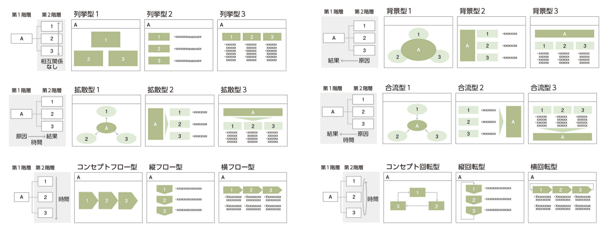

  <small>
    <a href="https://onl.bz/q5xHTij">PowerPoint資料作成プロフェッショナルの大原則</a>
  </small>

----
## オリジナル

    

    基本フォーマットに当てはまらない場合、自分で図解を作成する 
    2軸に収めることと、必ずメッセージと軸を揃えることを意識する
    

  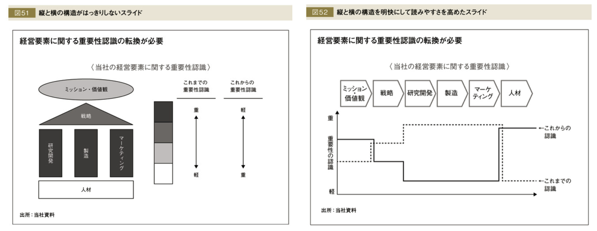

  <small>
    <a href="https://onl.bz/L9Zwew3">外資系コンサルのスライド作成術</a>
  </small>

----
## 人間の認知

    

    人間の目線の動き、グルーピングの傾向を踏まえたスライドにする
    

    <ul style="list-style-type: disc; padding-left: 20px;">
    <li>左から右、上から下に目線は動く</li>
    <li>近くにあるものは同じグループだと認識する</li>
    </ul>

  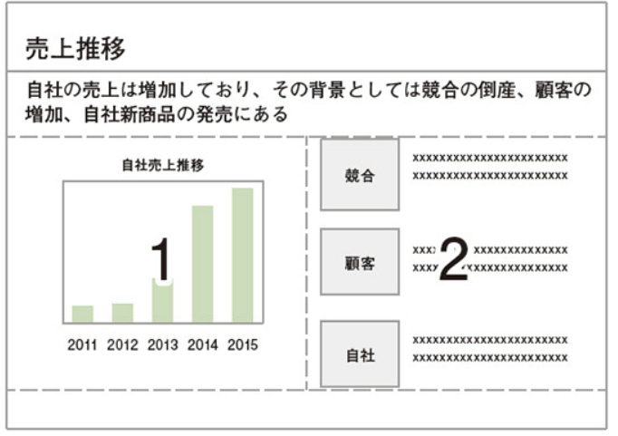
  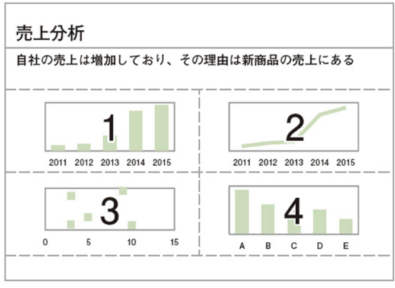

  <small>
    <a href="https://onl.bz/q5xHTij">PowerPoint資料作成プロフェッショナルの大原則</a>
  </small>

---
# プレゼンテーション
常にスライドのどの位置付けにいるかを示す
----
## スライド全体の流れ

    

    全体像、現在のスライドの立ち位置を常にわかるようにする 
    セクション間にアジェンダと対象を目立たせておく 
    

  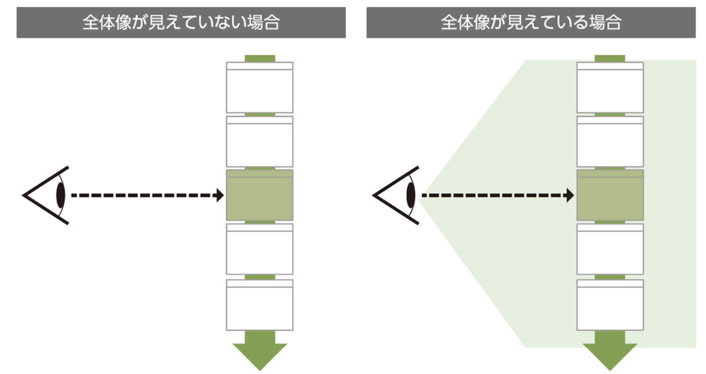
  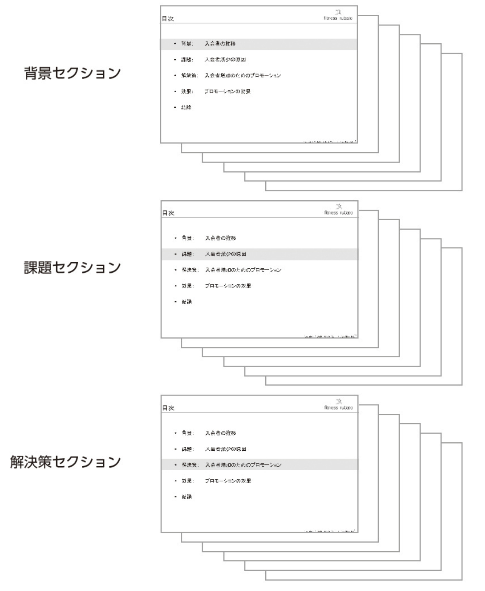

  <small>
    <a href="https://onl.bz/q5xHTij">PowerPoint資料作成プロフェッショナルの大原則</a>
  </small>

----
## セクションの流れ

    

      パンくずリストで、セクションの中でどの位置付けになっているかを示す
    

  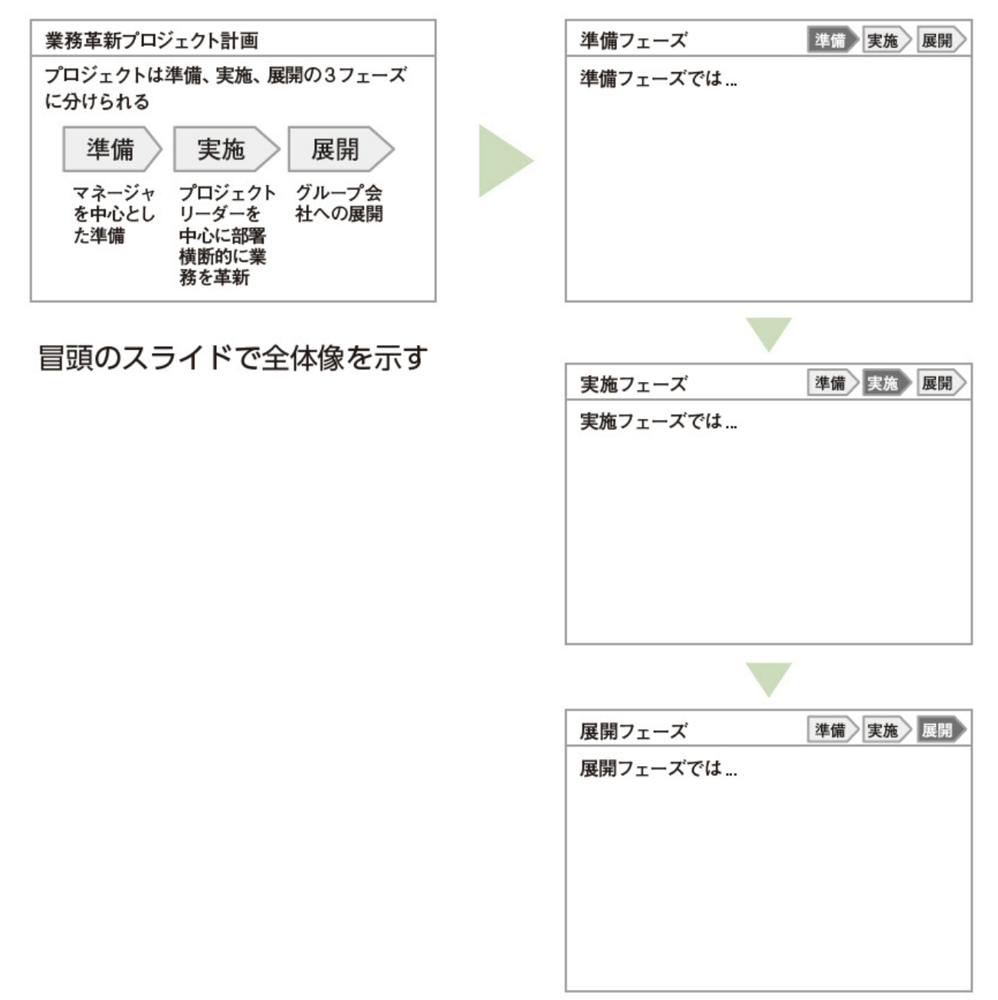

  <small>
    <a href="https://onl.bz/q5xHTij">PowerPoint資料作成プロフェッショナルの大原則</a>
  </small>

---
# 環境作り
効率的な作業環境は考える時間を増やす

----
## パワポの設定

    

      リボンは閉じる。よく使う項目はクイックアクセスツールバーに設定しておく
    

  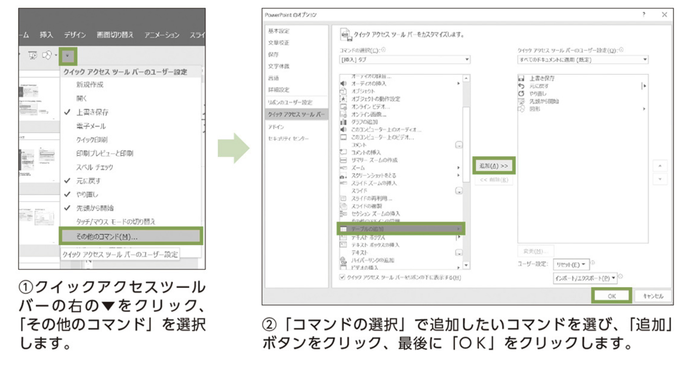

  <small>
    <a href="https://onl.bz/q5xHTij">PowerPoint資料作成プロフェッショナルの大原則</a>
  </small>

----
## おすすめ設定

    

    おすすめのアクセスツールバーの設定
    

  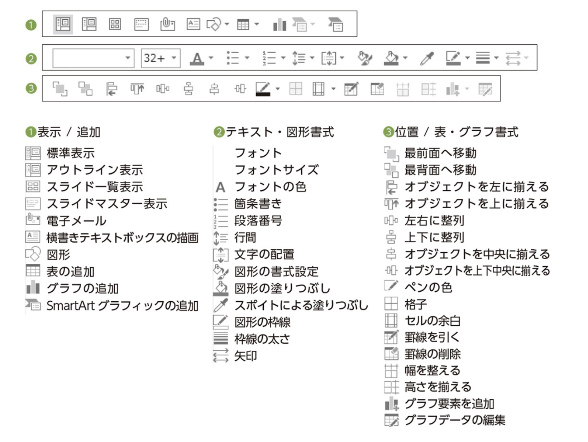

  <small>
    <a href="https://onl.bz/q5xHTij">PowerPoint資料作成プロフェッショナルの大原則</a>
  </small>

---
# 参考図書

----
## パワポを作成する前の分析

  
    仕事の価値は問の質と解の質で決まる 
    問の質を高めるための、 
    情報収集について理解できる

  <small>
    <a href="https://onl.bz/haXWKqB">ISSUE Driven</a>
  </small>

----
## スライド１枚１枚の作り方

  
    スライド・グラフ・チャートの 基本フォーマットと シンプルな原則を理解できる    

  <small>
    <a href="https://onl.bz/L9Zwew3">外資系コンサルのスライド作成術</a>
  </small>

----
## パワポ作成の最初から最後までを一気通貫で理解する

  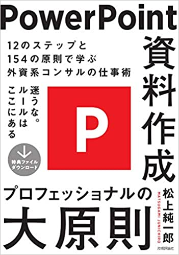
    パワーポイントの便利な設定から送付方法まで網羅的にカバー 
    一人歩きして人を動かせる資料を早く作る本

  <small>
    <a href="https://onl.bz/q5xHTij">PowerPoint資料作成プロフェッショナルの大原則</a>
    
  </small>

